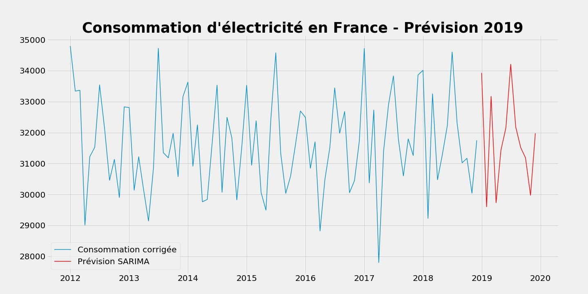

# Projet : Prédiction de la demande en électricité sur le marché français
### Projet du parcours Data Analyst OpenClassrooms réalisé en partenariat avec l’ENSAE-ENSAI.
Projet de prédiction d'électricité en France à partir de données réelles. Manipulation de données, modélisation de type régression linéaire, ainsi que différentes modélisations de séries temporelles (Holt-Winters, SARIMA).




## Préambule
Pour ce projet, les données ont été manipulées en Python sur support Jupyter Notebook. Traitement effectué (correction de l'effet température, désaisonnalisation, etc.), représentation graphique des séries temporelles, avant et après traitement.

### Les données
[Données mensuelles de consommation totale d'électricité en énergie](http://www.rte-france.com/fr/eco2mix/eco2mix-telechargement)\
[Données météo pour corriger l'effet température](https://cegibat.grdf.fr/simulateur/calcul-dju)

*Les consommations en électricité sont exprimées en Gigawatt (GWh).* 

### Compétences évaluées
 - Maîtriser les méthodes de lissage et la méthode de Holt-Winters
 - Maîtriser les notions de composantes et de modèles de décomposition
 - Maîtriser la méthode ARMA
 - Représenter graphiquement une série temporelle


## Prérequis techniques
Si vous n'avez jamais installé **Python**, alors autant installer directement la **distribution Anaconda**.
Anaconda est donc une distribution Python, faite pour la Data Science.

De cette manière on peut installer Python et ses librairies de Data Science Pandas, Matplotlib, Seaborn, Scipy, Numpy etc… 
Mais aussi le notebook Jupyter, qui reste incontournable et vivement recommandé!
C'est par ici : [Anaconda](https://www.anaconda.com/download)

Si vous souhaitez lancer le projet, il sera nécessaire d'installer Jupyter Notebook sur votre mahcine. 
La doc. Jupyter est accessible via : [Jupyter Documentation](https://jupyter.readthedocs.io/en/latest/install.html) 

```
python -m pip install --upgrade pip    
python -m pip install jupyter
```

Pour tester l'installation, vous pouvez taper dans votre console la commande suivante :

```
jupyter notebook
```

### Installation des librairies Python uniquement
*Pour installer python ainsi que les librairies de Data Science, il est fortement recommandé d'installer la distribution Anaconda.* 

```
pip install pandas
pip install matplotlib
pip install numpy
pip install scipy
```

## Auteur

**Nalron** *(Nicolas Pasero)* [Persona](https://nalron.com) - *Initial work* - [Github Nalron](https://github.com/nalron)
